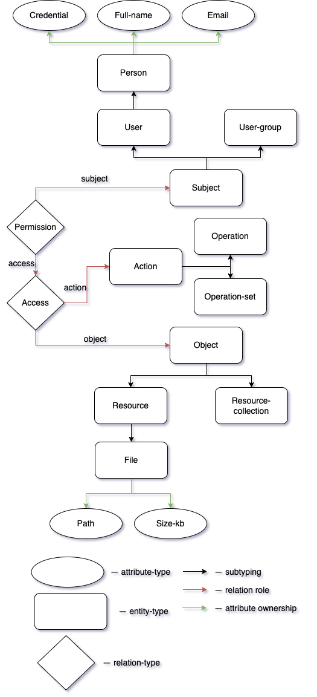
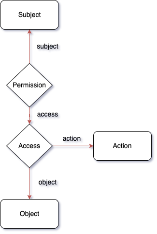
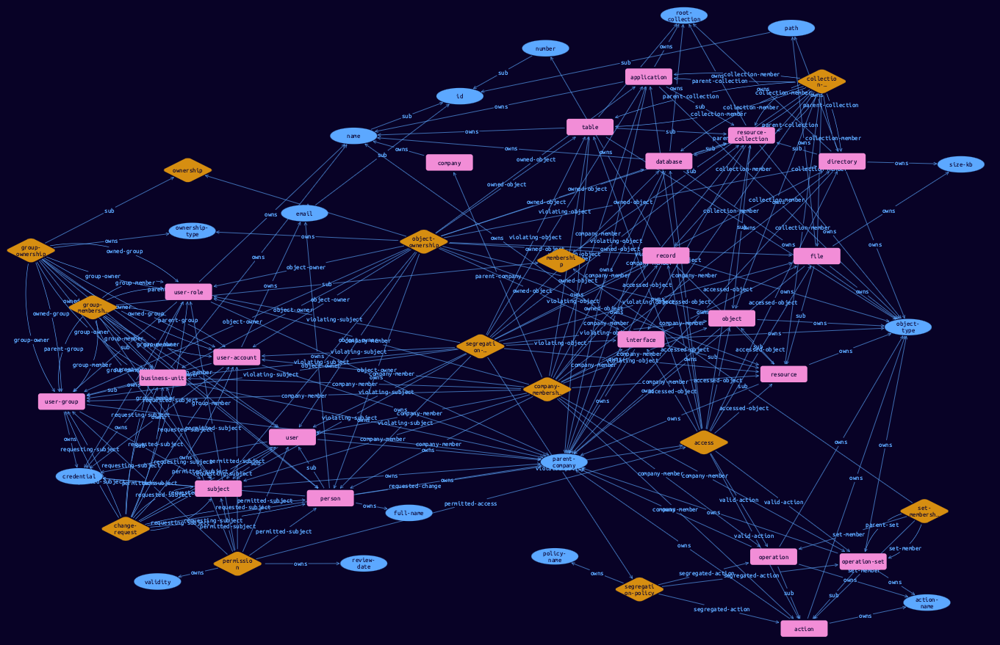
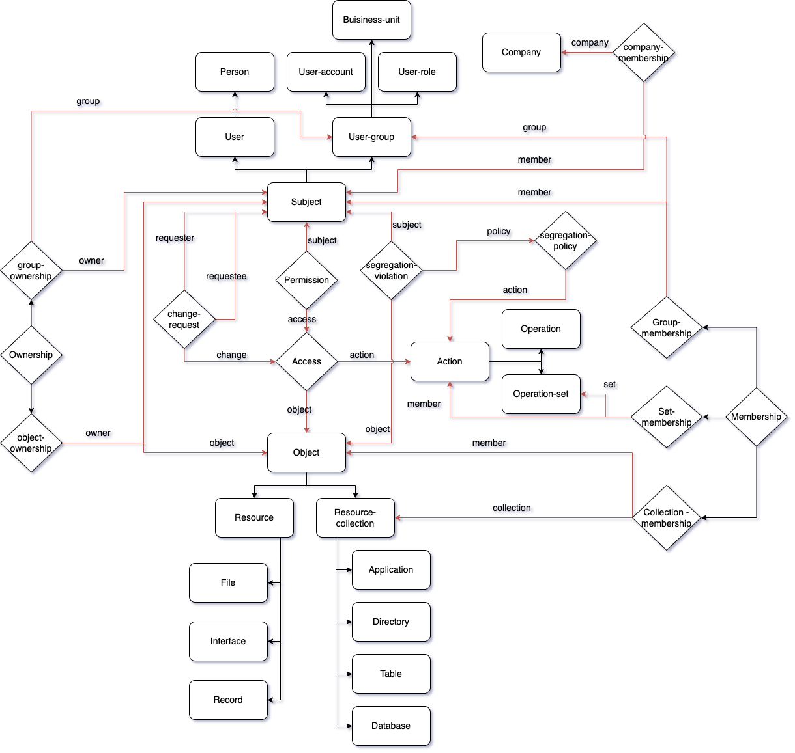

# IAM schema explanation

## Introduction

**Identity and access management** (**IAM**) is a complex field that has seen massive growth over the past two decades 
to meet user demand. IAM systems have become progressively more complicated to account for the variety of user 
requirements and to ensure compatibility with a backlog of legacy systems, leading to the definition of standards by 
governing bodies, such as [NIST](https://doi.org/10.6028/NIST.SP.800-63-3), in an attempt to unify and simplify the 
state of IAM ecosystems, as well as to set out best practices. Modern IAM systems, such as the 
[RSA’s Identity Governance and Administration Platform](https://www.rsa.com/solutions/identity-governance-and-administration/), 
implement these models while providing APIs to existing IAM systems an organization might have in order to unify IAM 
under a single management framework.

<div class="note">
[Note]
The terminology used in the IAM [schema](03-quickstart.md#prepare-a-tql-file) is defined according to the sources 
mentioned above and ISO/IEC 15408-1 standard within the context of an information system.
</div>

<div class="note">
[Note]
The Identity and Access Management database [schema](03-quickstart.md#prepare-a-tql-file) and accompanying 
[dataset](03-quickstart.md#insert-data) described here are used in most examples throughout TypeDB documentation, 
including the [Quickstart guide](03-quickstart.md).
</div>

## Overview

As with any [TypeDB schema](../02-dev/02-schema.md), the IAM schema consists of:

- Types
  - Entity types
  - Relation types
  - Attribute types
- Rules

The [schema](../02-dev/02-schema.md) page will later provide more information to better understand the 
terminology of TypeDB schemas.

The main entity types in the IAM schema:

- Subject — Active entity in the _system_ that performs operations on objects. 
  - User — Human or IT entity possibly interacting with the _system_ from outside of the _system_ boundary.
    - Person — User with `credentials`, `email`, and `full-name` attributes.
  - User-group — A group of users that share the same role.
- Object — Passive entity in the _system_, that contains or receives information, and upon which subjects perform
  operations. 
  - Resource — Anything usable or consumable in the _system_.
    - File — File in some filesystem with `path` (to the file) and `size-kb` (file size in kB) attributes.
  - Resource-collection — A group of resources.
- Action — An operation or operation set that can be performed on a specific type of object. Its name is stored in
  the `action-name` attribute.

<div class="note">
[Note]
In the list above some entities have attributes that are mentioned in their description.
</div>

The main relation types in the IAM schema:

- Permission — A relation that relates a subject to a specific access.
- Access — A relation that relates an object to a valid action performed on it.

The types mentioned above combined together in a schema will look like this:



The illustration above is not the full IAM schema but only the most important part of it. The least important parts
have been omitted from the image to reduce the complexity of the schema. For a full version, please see the image in
the [Full schema](#full-schema) section below.

## Permission and Access relations

One of the core elements of the IAM schema is the relations between `subject` and `object` entity types that allow  
to set `permissions` to access something.

There are two relation types involved:

- `permission`
- `access`

The `permission` relation connects a `subject` (e.g. `person`) via a `permitted-subject` role and `access` relation via 
`permitted-access` role.

The `access` relation connects an `object` (e.g. `file`) via an `accessed-object` role, `action` (e.g. `view_file`) via 
the `valid-action` role, and plays a role of `permitted-access` in a `permission` relation.



Taken together, a `subject` has permission to perform a specific action on a specific object. For example, `John Smith` 
has permission to read the `README.md` file.

## Object subtypes

The `object` is a subtype of the base `entity` type with multiple subtypes of its own:

- Object
  - Resource
    - File
    - Interface
    - Record
  - Resource-collection
    - Application
    - Directory
    - Table
    - Database

### File entity

The `file` type is not a direct subtype of the `object` type, but a subtype of the `resource` type, which is a subtype 
of the `object` type. That also makes the `file` type a subtype of the `object` type, just not a direct subtype.

The `resource` subtype doesn't have any relations or attributes of its own, only those inherited from the `object` type.

The `file` type plays the same roles as the `object` supertype.

It has all the attributes the `object` supertype has and also two attributes of its own:

- `path` — the path to the file on the filesystem
- `size-kb` — the size of the file in KB

## Subject subtypes

The `subject` is a subtype of the base `entity` type with multiple subtypes of its own:

- Subject
  - User
    - Person
  - User-group
    - Business-unit
    - User-account
    - User-role

### Person entity

The `person` type is not a direct subtype of the `subject` type. It is a subtype of the `user` type, that is a direct 
subtype of the `subject` type. That also makes the `person` type a subtype of the `subject` type.

But the `user` subtype doesn't have any relations or attributes of its own, only those inherited from the `subject` type.

The `person` type plays the same roles as the `subject` supertype.

It has all the attributes the subject supertype has and also two attributes of its own:

- `full-name` — the full name of the person. Usually includes first name and last name.
- `email` — the e-mail address of the person.

## Action entity

The `action` is an abstract type (a subtype of the base `entity` type) that has three attributes:

- `action-name`
- `object-type`
- `parent-company`

Additionally, `action` can play a role in multiple relations:

- `access` relation as role `valid-action`
- `company-membership` as role `company-member`
- `segregation-policy` as role `segregated-action`
- `set-membership` as role `set-member`

Finally, `action` has two subtypes, which are not abstract, so we can create instances of those subtypes:

- `operation` — a single action that can be performed on an object
- `operation-set` — a set of actions that can be performed on an object

Both subtypes inherit all the attribute and relation types defined in the action type.

## Membership subtypes

The `membership` is a relation type that has multiple subtypes for different kinds of relations, regarding membership 
in groups:

- `membership`:
  - `collection-membership` — combines objects in resource-collections
  - `group-membership` — combines subjects in user-groups
  - `set-membership` — combines actions in operation-sets

## Ownership subtypes

The `ownership` is a relation type that has multiple subtypes for different kinds of relations, regarding ownership 
groups:

- `ownership`:
  - `object-ownership` — assigns an owner of the subject type for an object
  - `group-ownership` — assigns an owner of the subject type for a user-group

## Segregation policy

Relation type that adds information on [duty segregation](https://en.wikipedia.org/wiki/Separation_of_duties) policies. 
It has a `name` attribute and a single role `segregated-action`. Usually, multiple instances of this role in a single 
relation mean these actions can’t be performed by one person.

## Rules

There are multiple rules in the schema that can be used in different situations and queries.

1. `attribute-parent-company`
2. `automatic-member-collection`
3. `automatic-root-collection`
4. `transitive-membership`
5. `transitive-object-access`
6. `transitive-action-access`
7. `transitive-subject-permission`
8. `transitive-object-permission`
9. `transitive-action-permission`
10. `automatic-segregation-violation`
11. `automatic-permission-invalidity`
12. `automatic-permission-validity`
13. `add-view-permission`

### add-view-permission rule

This simple rule illustrates basic inference. More information on rules can be found in the 
[schema](../02-dev/02-schema.md#rules) documentation page.

<!-- test-ignore -->
```typeql
define

rule add-view-permission:
when {
    $modify isa action, has action-name "modify_file";
    $view isa action, has action-name "view_file";
    $ac_modify (accessed-object: $obj, valid-action: $modify) isa access;
    $ac_view (accessed-object: $obj, valid-action: $view) isa access;
    (permitted-subject: $subj, permitted-access: $ac_modify) isa permission;
} then {
    (permitted-subject: $subj, permitted-access: $ac_view) isa permission;
};
```

The `when` clause defines the following conditions:

1. An `action` entity with action-name `modify_file`, assigned `$modify` variable.
2. An `action` entity with action-name `view_file`, assigned `$view` variable.
3. An `access` relation, that relates some `object` (`$obj`) to `$modify` as `valid-action` role, assigned `$ac_modify` 
   variable.
4. The similar relation but with `$view` instead and assigned `$ac_view` variable.
5. A `permission` relation, that relates some `subject` (`$subj`) as `permitted-subject` to the `$ac_modify` as 
   `permitted-access`.

The `then` clause defines the data to infer:

1. A new `permission` relation, that relates the subject `$subj` as `permitted-subject` to `$ac_view` as `permitted access`.

<div class="note">
[Note]
These new `permission` relations, created by the rule, will not be persisted as they will be created inside a **read** 
transaction with inference option enabled. They will influence the results of queries of the transaction (because 
inference option is enabled for transaction) but not the persisted database data.
</div>

#### Explanation

In the rule above:
- for every `subject` that already has permission to `modify_file` action on any `object`, 
- adds permission to `view_file` on the same `object` for the same `subject`. 
 
In short, if someone has **modify** access to a file, then they have **view** access too.

It’s easy to check this rule in action: by creating a `modify_file` access `permission` for a `subject`/`object` pair, 
and then checking the `view_file` access `permission` for the same pair of `subject`/`object` with the 
[inference](../02-dev/06-infer.md) option enabled.

## Full schema

This is the TypeDB Studio visualization of the full IAM schema:



And this is the same schema but without all attributes and streamlined a bit:



## Miniature dataset

The miniature dataset that we have loaded in the [Quickstart guide](03-quickstart.md#insert-data) consists of the following:

- Subjects section:
  - 3 subjects with `full-name` and `email` attributes.
- Objects section:
  - 10 `objects` of the `file` type with `path` attribute and optional `size-kb` attribute.
- Operations:
  - Only 2 operations with `action-name` attributes with values `modify_file` and `view_file`.
- Potential access types:
  - All 10 `objects` set to have `modify_file` operation as `valid-action`.
  - All 10 `objects` set to have `view_file` operation as `valid-action`.
- Permissions:
  - Subject with `name` attribute `Kevin Morrison` set to have permission to `modify_file` action for all 10 subjects.
  - Subject with `name` attribute `Pearle Goodman` set to have some random permissions to `modify_file` or `view_file` 
    actions for some subjects.
  - Subject with `name` attribute `Masako Holley` doesn't have any permissions.
